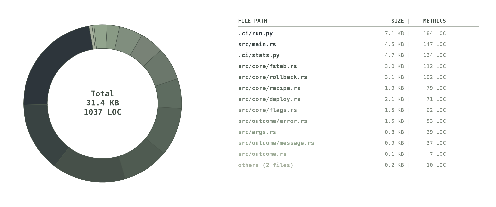

# Abyss Snaps

A filesystem state machine and orchestrator for Btrfs.

## Features
* **Recipe Snapshots**: Snapshots and rolls back only paths marked as `tracked` in the provided recipe.
* **Untracked Paths**: Paths outside the `tracked` list are never snapshot and stay live.
* **Single Volume Out of the Box**: Supports only one Btrfs disk volume (`subvolid=5`) by default.
* **Multi-Disk & Non-Btrfs**: External orchestration allows using any number of disks, including non-Btrfs filesystems.
* **Orchestration**: Includes compact flags for easy external control.
* **Fstab Generation**: The tool automatically generates `fstab` configurations.
* **SSOT**: The provided recipe acts as the Single Source of Truth (SSOT).
* **JSON Output**: Output uses a strict JSON contract and is easy to parse.

<p align="center">
  
</p>

## Installation

Install the pre-compiled static binary directly to your system:

```sh
sudo curl -L -o /usr/local/bin/abyss-snaps https://https://github.com/abyss-stack/snaps/releases/tag/2026.07.29-1/abyss-snaps \
  && sudo chmod +x /usr/local/bin/abyss-snaps
```

Verify the installation:
```sh
abyss-snaps --version
```
